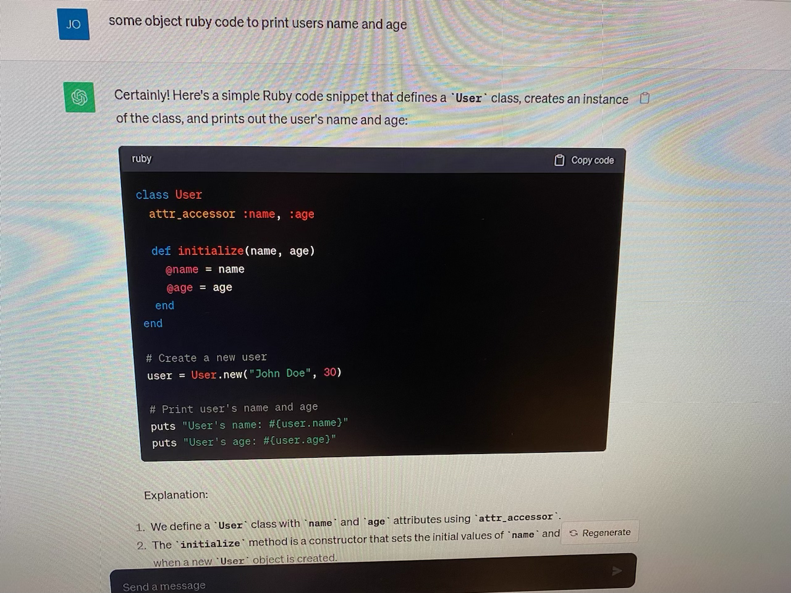
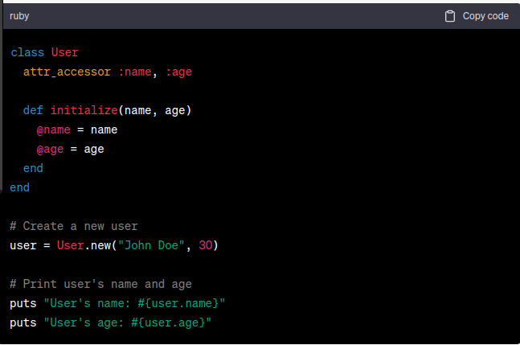
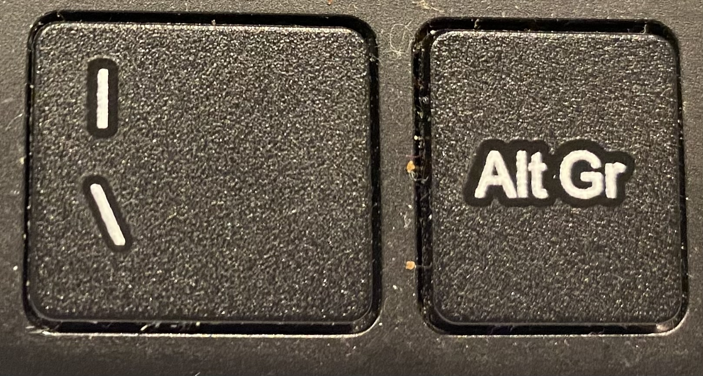

# Writing Good Documentation

## Step 1 - Using Codeblocks.

Codeblocks in markdown make it *very easy* for tech people to **copy, paste, share** code.
A good Cloud Engineer uses Codeblocks whenever possible.

Because it allows others to copy and paste their code to replicate or research issues.

- In order to create codeblocks in markdown you need to use three backticks (`)
- Not to be confused with single quotation(')


```
# Define a person class
class Person
   # Constructor
   def initialize(name, age)
     @name = name
     @age = age
   end

   # Instance method to return a greeting
   def greeting
     "Hello, my name is #{@name} and I am #{@age} years old."
   end
end

# Create a new instance of the Person class
person1 = Person.new("Alice", 30)

# Print out the greeting
puts person1.greeting
```

- When you can you should attempt to apply syntax hightlighting to you codeblocks
  
```ruby
# Define a person class
class Person
   # Constructor
   def initialize(name, age)
     @name = name
     @age = age
   end

   # Instance method to return a greeting
   def greeting
     "Hello, my name is #{@name} and I am #{@age} years old."
   end
end

# Create a new instance of the Person class
person1 = Person.new("Alice", 30)

# Print out the greeting
puts person1.greeting
```

- Make not of where the backtick button is located
- It shoule appear between the escape and tab key but it may vary based on your keyboard.


Note the above image is in the assests directory but we are not using that file here.


Good Cloud Engineers use codeblocks for both code and errors tat appean in the console.

```bash
Traceback (most recent call last):
   2: from /usr/bin/irb:23:in `<main>`
   1: from (irb):1 
RuntimeError: This is a custom error message
```

> Here  is a an exmample of using  a codeblock for an error that appears in Ruby.

When you can always provide a codeblock instead of a screenshot
If you need to take a screen shot make your its not from your phone.

> There are certain cases where it's ok to take photos with your phone.  This is when you are showing something like a keyboard, which does not appear on a computer screen.
If it is rendered on your computer screen it should be a screenshot.

## Step 2 - How to take screenshots

A screenshot is when you capture a part of your screen from your laptop, desktop or phone

Ths is not to be confused with taking a photo with your phone.


**DON'T DO THIS**




**Do This Instead**




## Step 3 - Use Github Flavored Markdown Task Lists

Githib extends Mardown to have a list where you can check off items <sup>[1]</sup>

- [x] Finish Step 1
- [x] Finish Step 2
- [x] Finish Step 3

# Step 4 - Use Emojis (Optional)
Github Flavored Mardown (GFM) supports emoji shortcodes
Here are some examples

| Name | Shortcode | Emoji |
| --- | --- | --- |
| Cloud | `:cloud:` | :cloud: |
| Cloud | `:cloud_with_lighting:` | 🌩️ |


# Step 5 - How to create a table

You can use the following mardown format to create tables:

``md
| Name | Shortcode | Emoji |
| --- | --- | --- |
| Cloud | `:cloud:` | :cloud: |
| Cloud with lighting | `:cloud_with_lighting:` | 🌩️ |


Github extends the functionality of Markdown tables to provide more alignment and tables formatting options.[<sup>[2]</sup>](#external-references)

- Make not of where the pipe key button is located
- In the attached photo the pipe key is between the space bar and Alt Gr key
  



## External References
- [Basic writing and formatting syntax](https://docs.github.com/en/get-started/writing-on-github/getting-started-with-writing-and-formatting-on-github/basic-writing-and-formatting-syntax)
- [GitHub Flavored Markdown Spec ](https://github.github.com/gfm)
- [Original Website Example](https://github.com/omenking/github-docs-example))
- [GFM - Github Flavored Markdown Task Lists](https://docs.github.com/en/get-started/writing-on-github/getting-started-with-writing-and-formatting-on-github/basic-writing-and-formatting-syntax#task-lists) <sup>[1]</sup>
- [GTM - Emoji CheatSheet](https://github.com/ikatyang/emoji-cheat-sheet)
- [GFM - Tables ( with extensions ) ](https://githib.github.com/gfm/#tables-extension-)<sup>[2]</sup>
